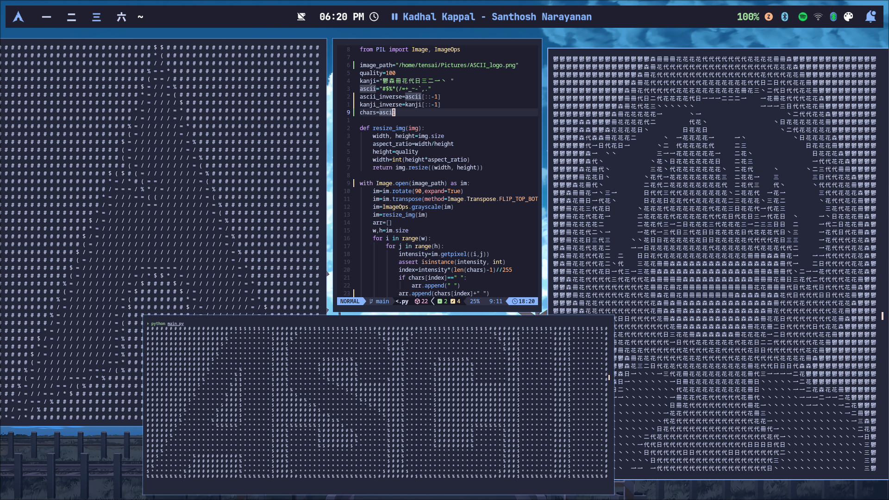

# Image to ASCII converter

This python script converts any image into ascii art using a set of ascii characters or kanji characters.

## Features
- Converts any image into ASCII art
- Adjustable quality(by changing the quality variable)
- Use custom characters to render the image

## Example output


## Requirements
- python 3.x
- [pillow](https://python-pillow.github.io/) (the friendly PIL fork)

## Installation 
1. Clone the repository
```bash
git clone https://github.com/geniusjoelraj/image-to-ascii
```
2. Navigate to the project directory
```bash
cd image-to-ascii
```
3. Install the required dependencies
```
pip install pillow
```

## Usage
1. Set you image path
```python
image_path="/path/to/your/image"
```

2. Run the script
```bash
python main.py
```

3. To save ASCII art to file
```bash
python main.py > /path/to/the/file
```

## Configuration
- Adjust the quality of the ASCII art(height of the art)
```python
quality=100
```
- Custom character set
```python
chars="your character set"
```


## License
This project is licensed under the MIT License. See the [LICENSE](LICENSE) file for details.
